### Template

### Name

**Name/s**** : **

**Scientific name**** : **

**Class**** : **

**Description**** :** 

**Habitat**** : ** 

**Threat** **: **

**Fun fact :**

### Spotted jelly

**Name**** : **spotted jelly, lagoon jelly, golden medusa, and Papuan jellyfish. ^[1]^

**Scientific name**** : ***Mastigias papua*

**Class**** : **Scyphozoa

**Description**** :** They have spots on top of its bell with 8 frilled arms. The upper surfaces of these arms are covered in stinging cells called *cnidocytes. *Unlike the majority of jellyfish, Spotted jellies have mouths along the bottom of their arms. They vary in coloration from teal to green.^[2]^ The jelly average 10cm (4 in) in diameter but can grow as large as 30 cm (12 in). ^[3]^

**Habitat**** : **They rise near the surface during the day until the sun sets, then they sink further down into the ocean for the night.^[2]^

**Threat** **: **Mildly dangerous to humans. 

**Fun fact**** : **These jellies have what's called a zooxanthellae in their tissues, which is a photosynthetic alga. This causes them to be bright yellow, hence their name of Golden medusa. ^[3]^

Spotted jellyfish can be found in Pulau in large groups called “smacks”. The most famous spot to admire them is at Ongeim'l Tketau Lake in Pulau, also known as the Jellyfish lake. ^[4]^

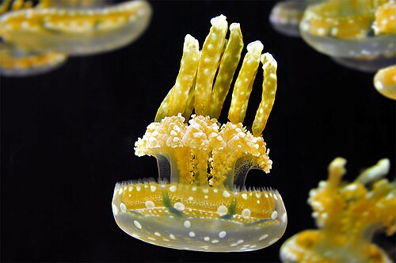
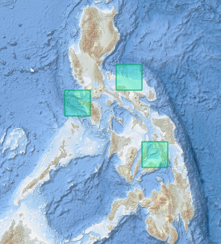

### Australian box jellyfish

**Name/s**** : **Box jellyfish. 

**Scientific name**** : ***Chironex fleckeri*

**Class**** : **Cubozoa

**Description**** :** They are distinguished by their cube-shaped bell that reaches 16cm (6.3 in) in diameter but can grow up to 35cm (14 in). They have 15 tentacles that when contracted are 6 in long, but when hunting, the arms go thinner and extend to around 3m (9.8 ft) long.^[1]^ The arms are covered in many stinging cells called *cnidocytes*. Box jellyfish are transparent, making them nearly impossible to see in the waters. 

**Habitat**** : **Box jellyfish linger closer to the shore, and near-shore places such as mangroves, coral reefs, kelp forests and sandy beaches. ^[2}^

**Threat** **: **Very dangerous to humans

**Treatment : **Immediately flush the area with vinegar to deactivate undischarged nematocysts ( the venom ) to prevent release of additional venom.

Remove additional tentacles with a towel or glove to prevent second hand stinging. The arms are still active after the body is dead and or if they've been detached.

**Fun fact : **Box jellies have 4 eye-clusters with 24 eyes. Some of the eyes seem capable of forming images but further information is debated or unknown. They are attracted to light of different colors (white, red, orange, yellow, and green). Blue elicits a feeding behavior^[3]^ but darker objects cause them to move away.^[2}^

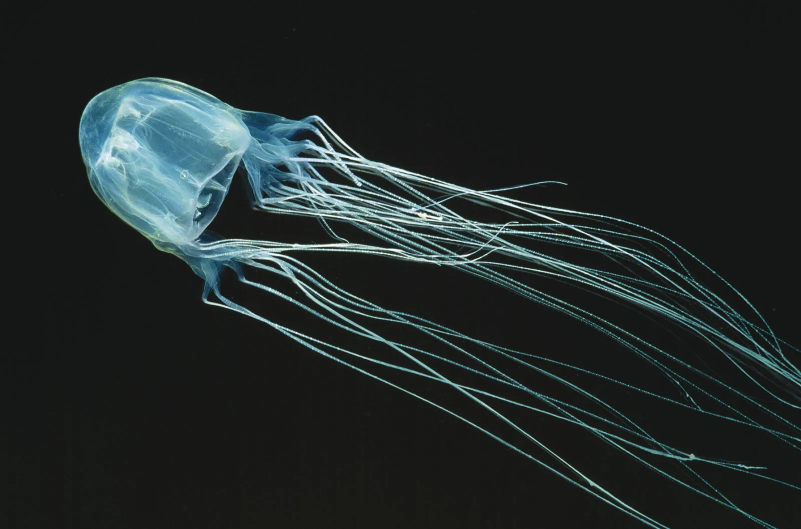
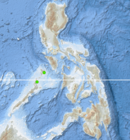

*there is not much information on this jelly, some info may be inaccurate.

### Tomato jellyfish

**Name/s**** :** Tomato jellyfish, edible jellyfish, red ball jellyfish, red jellyfish, rhizostomae jellyfish, and sea tomato.^[1]^

**Scientific name**** : ***Crambione mastigophora*

**Class**** : **Scyphozoa

**Description**** :** The tomato jellyfish has a bell that gets up to 40cm (15 in) in diameter, with 8 main arms with 8-11 strings attached to each arm. Their body ranges from magenta to yellow.^[2]^

**Habitat**** : **They are usually found in deep, cold water during the day but rise to the surface at night to feed. They can also be found washed up along beaches.^[1]^

**Threat** **: **Mildly dangerous to humans.^[3]^

**Fun fact : **Tomato jellies are edible and are usually consumed semi dried and salted as a snack across southeast Asia.^[4]^

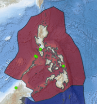

### Moon jelly

**Name/s**** : **Moon jellyfish/jelly, common jellyfish and saucer jelly. 

**Scientific name**** : ***Aurelia aurita*

**Class**** : **Scyphozoa

**Description**** :** It's almost entirely translucent and ranges in size from 25-40 cm (10-16 in) in diameter. Its most notable feature is the four horseshoe-shaped gonads located at the top of its bell. They lack long tentacles, instead having short, fine ones that line the bell margin.^[1]^ The moon jelly has the ability to sting but it doesn't pose a threat to humans, only offering a little discomfort and a rash which lasts a few hours. ^[2]^

**Habitat**** : ** They are found in temperate and tropical waters, as well as near the surface of shallow bays and harbors.^[3]^^[4]^

**Threat** **: **Not dangerous to humans. 

**Fun fact : **In 1991, NASA launched 2,478 jellyfish polyps into space to test how human babies would react to being raised in a low gravity environment, due to both humans and jellyfish having calcium crystals in their body which is used to help us understand gravity’s pull, this resulted in the jellyfish having trouble navigating in the ocean after the experiment.^[5]^

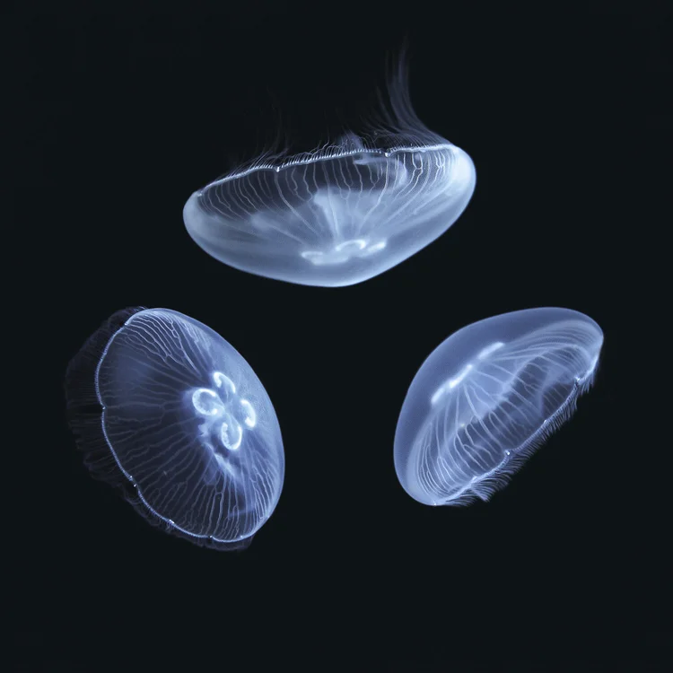
sunset marine labs

### Marble jelly

**Name/s**** : **Marble jelly^[1]^, fat armed jelly^[2]^, blue jelly ^[3]^

**Scientific name**** : ***Catostylus townsendi*

**Class**** : **Scyphozoa

**Description**** :** They’re semi transparent with a cream color to them that is occasionally tinted blue or pink. Their maximum length is only 10 cm (4 in)^[1]^. Their most recognizable feature are the 8 sausage-like arms which descend from inside the domed bell, they are broad and three-sided.^[2]^ There are faint brown spots that scatter across its bell and they become more prominent on the edge of it. 

**Habitat**** : ** The marble jellyfish reside in brackish lagoons^[3]^

**Threat** **: **Mildly dangerous (mild burning sensation).

**Fun fact : **In Vietnam it is a delicacy to eat marble jelly, or as they call it, blue jellyfish due to the various shades of blue it presents, which depends on the type of water they reside in. They are typically served as a cold salad in summer sashimi style.^[3]^

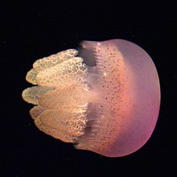
wikipedia

### Sand jellyfish

**Name/s**** :** Sand jellyfish^[1]^, edible jellyfish, hizen kurage^[2]^

**Scientific name**** : ***Rhopilema hispidum*

**Class**** : **Scyphozoa

**Description**** :** The wide exumbrella has numerous small and sharply pointed projections, each one having roughly 8 lappets which descend from it. Under those, they have small club shaped bulbs that have longer, thinner tentacles that hang from them. Its diameter ranges from 25-40 cm (10-15 in), with its max width being 70 cm (27 in).^[1]^

**Habitat**** : **It resides in tropical waters especially within coastal areas like bays and estuaries.^[1]^

**Threat** **: **Mildly dangerous (severe stinging and burning sensation)^[2]^

**Fun fact : **These jellyfish are a popular dried snack in China, Korea, and Japan, alongside just being commonly eaten in eastern and southeastern Asia.^[3]^

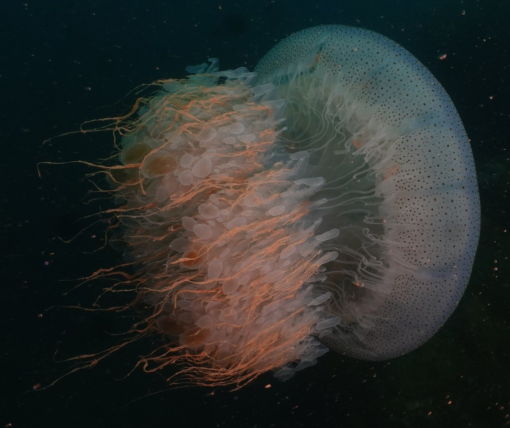
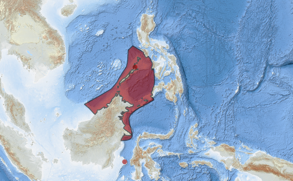

# 

### Sea wasp

**Name/s**** : **Sea wasp

**Scientific name**** : ***Chiropsalmus quadrigatus*

**Class**** : **Cubozoa

**Description**** :** Since sea wasps are transparent and pale blue, it can be challenging to spot them in the clear ocean water. The jellyfish is known widely as "box jellyfish" because of its bell-like or cube-like shape with four distinct sides. Every one of the four corners on each side extends into a pedalium, which may have up to 15 tentacles, each of which is 3 meters long.	

**Habitat**** : ** Found in the Indo-Pacific ocean but mainly around the Philippines^[ ]^ and Australia. It can appear during a rising tide with calm weather.

**Threat** **: **Very dangerous to humans

**Fun fact : **Various types of turtles and sea slugs are immune to the sea wasp’s stinging cells, making these jellies a perfect snack.

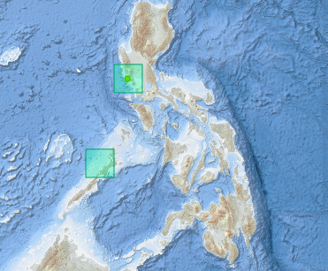
[https://www.marinespecies.org/aphia.php?p=taxdetails&id=527672#distributions](https://www.marinespecies.org/aphia.php?p=taxdetails&id=527672#distributions)

- [https://animaldiversity.org/accounts/Chiropsalmus_quadrigatus/](https://animaldiversity.org/accounts/Chiropsalmus_quadrigatus/) 

### Amakusa jelly

**Name/s**** : **Amakusa jelly, malaysian jellies

**Scientific name**** : ***Sanderia malayensis*

**Class**** : **Scyphozoa

**Description**** :** This translucent jellyfish could possess a violet tint or appear yellowish. On the mouth-arms or bell, there are occasionally rows of red dots that radiate outward. The bell's diameter can reach up to 13 cm (5 in), although 3 to 8 cm (1 to 3 in) is more typical. The frilled mouth-arms are 16 cm (6 in) long, while the peripheral tentacles can reach a length of 29 cm (11 in).

**Habitat**** : ** Indo-Pacific

**Threat** **: **Very dangerous to humans

**Fun fact :**** **They are jellyvorous, meaning they feed on other jellyfish, typically moon jellies

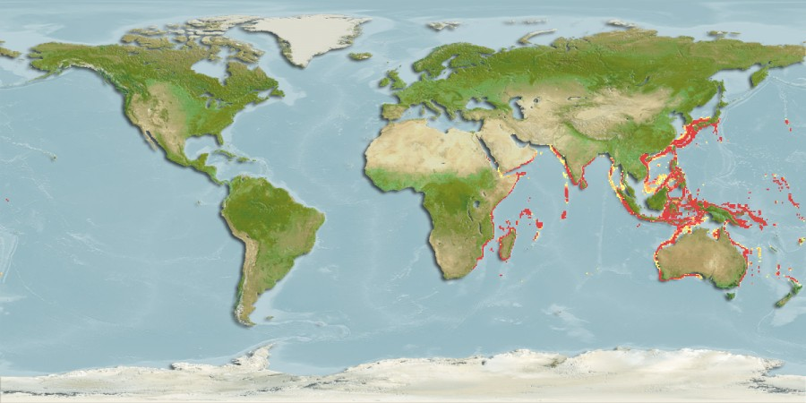

*there is not much information on this jelly, some info may be inaccurate.

### Edible jellyfish

**Name/s**** : **Edible jellyfish, Panther jellyfish

**Scientific name**** : **acromitus maculosus

**Class**** : **Scyphozoa

**Description**** :** The Panther jellyfish has a dome shaped bell that has panther like spots, hence the nickname. The color of the jelly itself is slightly transparent and tinted a pale blue. Their tentacles are max 3 cm (1 in) long.

**Habitat**** : ** Western central Pacific, mainly in TayTay bay

**Threat** **: **Not dangerous to humans 

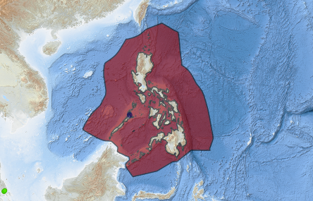

### Philippine Irukandji

**Name/s**** : **Philippine Irukandji, Malo filipina

**Scientific name**** : ***Malo filipina*

**Class**** : **Cubozoa

**Description**** :** They can be distinguished from other box jellies by their size which is between 30 and 40 mm (1.18-1.57 in). And also the location of their nematocysts, those of which are located equally spaced on the bell. Because of how transparent and small they are, it is very difficult to identify them.

**Habitat**** : **Western Pacific (mainly off the coast of the Philippines)

**Threat** **: **Very dangerous to humans

**Treatment : **Immediately flush the area with vinegar to deactivate undischarged nematocysts (the venom) to prevent release of additional venom. Put a heat pack on anywhere painful and take Nitroglycerin to delay and manage the on-set of symptoms.

**Fun fact : **the name Malo comes from the first two letters of Mark Longhurst, a man who survived a severe sting from the Malo genus. It also coincidentally means "bad" in Spanish

- copula sivickisi - sea wasp, marine stinger, box jellyfish ( taytay bay, palawan )

### Sivickis’ Box jelly

**Name/s**** : **Box jellyfish

**Scientific name**** : ***Copula sivickisi*

**Class**** : **Cubozoa

**Description**** :** This box jellyfish is very small as it only grows to around 10 mm (0.4 in) in diameter. It has a box shaped bell that is rimmed with bright orange, with the females having dotted white leaf-like shapes around the bell while males have orange dome shapes near the tip of the bell. When the female matures, she gains orange-brown patterns along the edge of the bell. ^[1]^

**Habitat**** : **comes out at night only

**Threat** **: **Not dangerous to humans (mild sting) ^[2]^

**Fun fact : **Unlike the majority of sea jellies spawn into the water, the Sivickis’ box jelly performs a courtship ritual known as the "wedding dance” where the male attaches his tentacles to the female and clings to her as he draws her in to impregnate her. ^[3]^

### Alarm jellyfish

**Name/s**** : **Coronate medusa, deep-sea jellyfish, Atolla jellyfish

**Scientific name**** : ***Atolla wyvillei*

**Class**** : **Scyphozoa

**Description**** :** This jelly ranges all the way from 3 cm (1 in) to 20 cm (8 in) in diameter, their bell resembles that of a UFO with tentacles that can grow up to 12 ft long. While in the depths of the ocean, they are completely transparent which helps them hide from their predators, though when attacked, they flash a blue light which attracts bigger predators who will eat the animal after the jelly, which has given it the fitting nickname of the alarm jellyfish^[1]^

**Habitat**** : **Around the globe, but found 1,000-4,000 m (3,280-6,561 ft)^[1]^

**Threat** **: **Not dangerous ^[2]^

**Fun fact :** The E-jelly, a tool developed by marine biologist Edith Widder based on the distress flashes of the Atolla jellyfish, has been effectively and successfully utilized to entice mysterious and rare deep-sea creatures for shooting and documenting. In an expedition funded by Discovery Channel and NHK to locate the creature, the gadget successfully attracted a big squid due to its imitation of the jelly^[3]^

### Ghost jellyfish

**Name/s**** : **Ghost jellyfish

**Scientific name**** : **** ***Cyanea nozakii*

**Class**** : **Scyphozoa

**Description**** :** The Ghost jellyfish has a bell that is either pale yellow or a cream color rather than being fully transparent. Their bell is more flat-topped and can reach a diameter of up to 50 cm (20 in.). It features eight bundles of marginal tentacles that resemble threads and eight huge marginal lobes. Each bundle may have one hundred or more tentacles that are either translucent or reddish in color and can reach a length of 10 meters (33 feet). Underneath the bell is the manubrim that holds the mouth in the center that’s hidden underneath a plethora of rusty-brown or orange tentacles.

**Habitat**** : ** *Cyanea nozakii* is found around the coasts of China^[2]^ and Japan.

**Threat** **: **Very dangerous to humans

**Fun fact :**

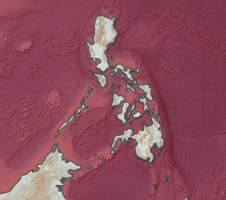

- chrysaora pacifica - sea nettle ( manila bay, san Miguel, Luzon )

- pelagia panopyra - sea nettle ( entirety of ph )

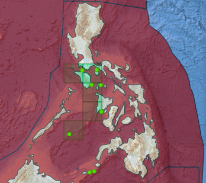

- cassiopea ornata - upside down jellyfish ( Iligan bay, Mindanao )

- cassiopea ndrosia - upside down jellyfish ( Iligan bay, Mindanao )

- acromitoides purpurus - dark brown jellyfish ( panguil bau, carigara bay, manila bay, babatngon, leyte, capoocan, barugo )

- Thysanostoma loriferum - purple jellyfish ( off Cebu, saranggani bay, honda bay, tao farm )

- versuriga anadyomene - NA ( barugo, leyte )

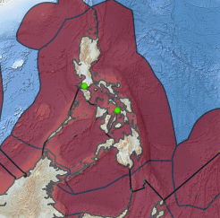

- alatina alata - winged box jellyfish ( moalboal reef, Cebu )

- carybdea rastonii - box jellyfish ( Mindanao )

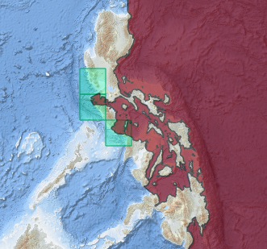
( drift? )

- chironex indrasaksajiae - box jellyfish ( babatngon, leyte )

- chironex yamaguchii - salabay ( babatngon, leyte, palawan )

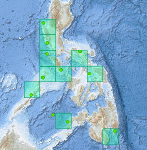

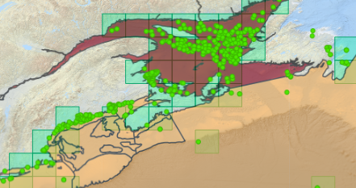
( moon jelly in america. It's funny )

# Other research : 

The highly lethal** cubomedusae Malo sp.** and **Morbakka sp.** have been respectively recorded in Taytay, Palawan

A recent study in Malampaya Sound, Northern Palawan has rediscovered the mangrove panther jellyfish, **Acromitus maculatus**

Comb jelly found between el nido and coron

[https://www.marinespecies.org/index.php](https://www.marinespecies.org/index.php)
